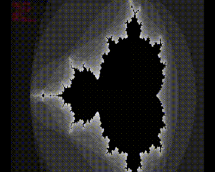

# mandel

C++ GUI for vieeing a standard Mandelbrot set.



This is just a personal throwaway project, rather tan something
serious. I want to explore SDL2, OpenGL, and (maybe) OpenCL with a toy
problem that is fairly well-defined.

## Building

Build toolchain: `cmake`, `make`, `c++`
Libraries: `libsdl2-dev`, `libsdl2-ttf-dev`

```bash
mkdir -p build/
cd build
cmake -DCMAKE_BUILD_TYPE=Release ..
make

# run
./mandel
```

